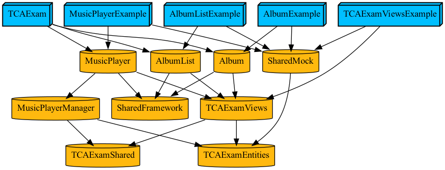

# TCAExam

## [기존 TCAExam](https://github.com/grohong/TCAExam/tree/origin) 문제점

### 각각의 Feature별 테스트가 어려움
TCAExam에서 모든 모듈을 통합하여 구현하다 보니, 개별 페이지의 기능 테스트를 위해 항상 TCAExam 전체를 빌드해야 했습니다. 이로 인해 다음과 같은 문제가 있었습니다.
* 실제 운영 빌드에 불필요한 Mock 데이터까지 포함됨
* Feature별 테스트가 어려워 디버깅 및 유지보수가 복잡해짐

### TCA 의존성 혼재
TCAExam에서 각각의 Feature를 구현하고 통합하는 과정에서, 하위 Feature의 `Client(Dependency에 정의된 의존성)`가 상위 Feature에서 사용되었습니다.

이 방식은 Clean Architecture의 원칙인 의존성의 명확한 분리가 되지 않고, 의존성 관리가 복잡해지는 문제가 생겼습니다.

---

## 개선 프로젝트
Clean Architecture의 목표인 **유지보수성**, **확장성**, **테스트 용이성**을 강화하기 위해 다음과 같은 변경을 적용했습니다.
* 의존성 독립: Feature 간 의존성을 분리하여 재사용성과 유연성을 강화
* 독립적 테스트 환경: Feature별로 독립된 예제 및 테스트 환경 제공

### 프로젝트 구성
프로젝트 구조는 기존과 유사하지만, 주요 Feature(AlbumList, Album, MusicPlayer)가 개별 모듈로 분리되었습니다. 

각 모듈은 독립적으로 관리되며, 필요 시 통합하여 사용하는 구조입니다.

```
TCAExam
  ├─ Features
  │   ├─ AlbumList
  │   ├─ Album
  │   └─ MusicPlayer
  ├─ Manager
  │   └─ MusicPlayerManager
  ├─ TCAFoundation
  │   ├─ TCAEntities
  │   ├─ TCAShared
  │   └─ TCAViews
  └─ Shared
      └─ Mock
```

### 개선방법

#### 모듈별 의존성 분리
기존에는 TCAExam이 모든 모듈의 의존성을 한곳에서 관리했습니다.
개선된 구조에서는 의존성 그래프처럼, 각 Feature가 필요한 모듈만 직접 참조하도록 분리했습니다.



* Feature 간 독립성: Feature(AlbumList, Album, MusicPlayer)는 필요한 데이터와 Manager를 직접 참조하며, 불필요한 의존성이 제거되었습니다.
* Shared 리소스 관리: 공통으로 사용하는 데이터(TCAEntities)나 Mock 데이터는 별도 모듈로 관리해 재사용성을 높였습니다.

#### 모듈별 테스트 환경 설정

`Tuist`를 사용해 Project를 생성하고, Feature별로 `Example`을 추가했습니다.

* 각 Feature는 독립적으로 빌드 및 실행이 가능하며, 통합 환경과 별도로 테스트를 진행할 수 있습니다.
* Mock 데이터를 활용해 실제 의존성이 없는 상태에서도 독립적 테스트가 가능합니다.

### 개선점

#### 의존성 분리로 인한 확장성 향상 
* Feature 간 의존성이 명확히 분리되면서 다음과 같은 이점이 생겼습니다.
	* 새로운 Feature를 추가하거나 기존 Feature를 수정할 때, 다른 모듈에 미치는 영향을 최소화 되었습니다.
	* Feature별로 필요한 의존성만 주입받아 관리가 용이해졌습니다.

* 유지보수성 강화
	* 독립적인 모듈로 구성된 Feature는 각 Feature 단위에서 수정, 확장이 이루어질 수 있습니다.
	* 수정 범위가 명확해 디버깅이나 코드 리뷰가 더 효율적입니다.

* 테스트 용이성 향상
	* Example 타겟을 통해 Feature별로 독립적으로 빌드 및 테스트 가능하게 되었습니다.
	* Mock 데이터 의존성을 테스트 빌드에서만 가지도록 분리할 수 있습니다.

--- 

## 빌드 & 실행 가이드
### 기술 스택
* 언어: Swift 6
* IDE: Xcode 16.2
* 대상 OS: iOS 18.0 이상
* 패키지 매니저: Tuist 4.38.1
* 아키텍처 프레임워크: TCA 1.17.0

### Tuist를 이용한 프로젝트 설정
1. Tuist 디펜던시 설정

```bash
tuist install
```

2. 프로젝트 생성

```bash
tuist generate
```

### 개별 모듈 실행
Features 디렉토리 아래의 각 프로젝트에서 Example 타겟을 선택하여 실행할 수 있습니다.